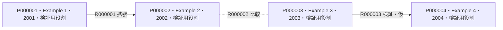

<!-- BEGIN GENERATED: topic-header -->
# 動作確認用の架空テーマ

[全体索引](<../../README.md>)
<!-- END GENERATED: topic-header -->

<!-- BEGIN GENERATED: topic-scope -->
全論文・著者・関係・出典は架空の検証用データです。実際の調査結果ではありません。
<!-- END GENERATED: topic-scope -->

<!-- BEGIN GENERATED: survey-status -->
調査日：未記録 ｜ 対象期間：制限なし ｜ 採用文献：4件  

この文献マップには誤りや抜けが含まれる可能性があります。気づいた点をご指摘いただければ、その都度修正します。
<!-- END GENERATED: survey-status -->

## 先行研究比較表

要点は「問い／方法／判明点・適用範囲」の3項目です。OA・無料公開欄には利用できるリンクを記載します。API由来の情報にはその旨を添えます。

<!-- BEGIN GENERATED: paper-tables -->
### 先行研究

| ID | タイトル | 著者 | 年 | 掲載誌／出版社 | OA・無料公開 | Preprint | 3項目要点 |
|---|---|---|---|---|---|---|---|
| P000001 | [検証用架空文献 1](<https://doi.org/10.5555/fixture-1>) | Example 1 | 2001 | 架空の検証用誌 未確認 | 未確認 | 未確認 | 問い：架空の問いを比較する。（[検証用の架空の節](<https://example.org/papers/1>)） 方法：架空のモデルを使う。（[検証用の架空の節](<https://example.org/papers/1>)） 判明点・適用範囲：これは実在研究の成果ではない。（[検証用の架空の節](<https://example.org/papers/1>)） 〔本文確認（出版版）〕 |
| P000002 | [検証用架空文献 2](<https://doi.org/10.5555/fixture-2>) | Example 2 | 2002 | 架空の検証用誌 未確認 | 未確認 | 未確認 | 問い：架空の問いを比較する。（[検証用の架空の節](<https://example.org/papers/2>)） 方法：架空のモデルを使う。（[検証用の架空の節](<https://example.org/papers/2>)） 判明点・適用範囲：これは実在研究の成果ではない。（[検証用の架空の節](<https://example.org/papers/2>)） 〔本文確認（出版版）〕 |
| P000003 | [検証用架空文献 3](<https://doi.org/10.5555/fixture-3>) | Example 3 | 2003 | 架空の検証用誌 未確認 | 未確認 | 未確認 | 問い：架空の問いを比較する。（[検証用の架空の節](<https://example.org/papers/3>)） 方法：架空のモデルを使う。（[検証用の架空の節](<https://example.org/papers/3>)） 判明点・適用範囲：これは実在研究の成果ではない。（[検証用の架空の節](<https://example.org/papers/3>)） 〔本文確認（出版版）〕 |
| P000004 | [検証用架空文献 4](<https://doi.org/10.5555/fixture-4>) | Example 4 | 2004 | 架空の検証用誌 未確認 | 未確認 | 未確認 | 問い：架空の問いを比較する。（[検証用の架空の節](<https://example.org/papers/4>)） 方法：架空のモデルを使う。（[検証用の架空の節](<https://example.org/papers/4>)） 判明点・適用範囲：これは実在研究の成果ではない。（[検証用の架空の節](<https://example.org/papers/4>)） 〔本文確認（出版版）〕 |
<!-- END GENERATED: paper-tables -->

## 論文間の関係図

実線は文献中の言及、点線は本マップでの比較整理を表します。矢印は基礎・対象側から、それを拡張・利用・検証する側へ向きます。仮の関係には「仮」を添えます。

<!-- BEGIN GENERATED: relation-graphs -->
### 先行研究 · 1

図に未掲載の文献：該当なし。
<!-- END GENERATED: relation-graphs -->

## 関係の説明・参考情報

<!-- BEGIN GENERATED: relation-evidence -->
| 関係ID | 論文間の関係 | このように整理した理由 | 参考情報・参照版 | 区分 |
|---|---|---|---|---|
| R000001 | P000001 → P000002：拡張 | 架空モデル：表示検証用の架空の拡張関係。 | [P000002 / 出版版 / V000002 / 検証用の架空の節 / 2026-09-17](<https://example.org/papers/2>) | 文献中の言及 AI確認・2026-09-17 |
| R000002 | P000002 — P000003：比較 | 架空条件：表示検証用の架空の比較関係。 | [P000002 / 出版版 / V000002 / 検証用の架空の節 / 2026-09-17](<https://example.org/papers/2>) [P000003 / 出版版 / V000003 / 検証用の架空の節 / 2026-09-17](<https://example.org/papers/3>) | 本マップの比較整理 AI確認・2026-09-17 |
| R000003 | P000003 → P000004：検証 | 候補：根拠未確認の検証候補。 | 未記録 | 文献中の言及 仮の整理 |
<!-- END GENERATED: relation-evidence -->

<!-- BEGIN GENERATED: reading-notes -->

<!-- END GENERATED: reading-notes -->

## 調査範囲と更新

<!-- BEGIN GENERATED: survey-notes -->
検索経路：未記録。検索語：未記録  
採否方針：テーマの問いに関連する文献。  
除外範囲：指定なし。  
調査範囲：未実行  
未確認範囲：記録なし  
今回の更新：新規作成
<!-- END GENERATED: survey-notes -->

<!-- BEGIN GENERATED: navigation -->

<!-- END GENERATED: navigation -->

---

原著は各文献のDOI・公開記録をご参照ください。比較表と関係図は独自の整理であり、原著の全文、Abstract、図表は再配布しません。
