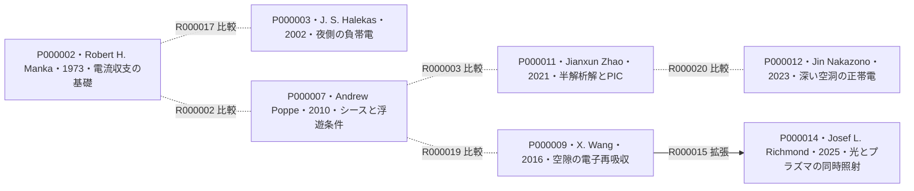
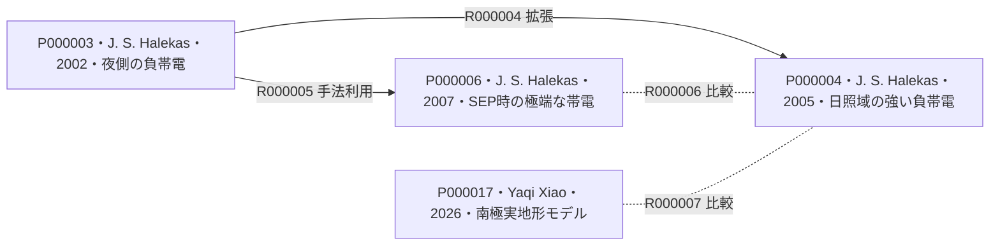
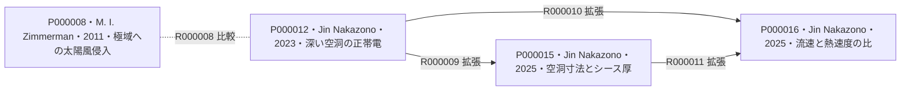
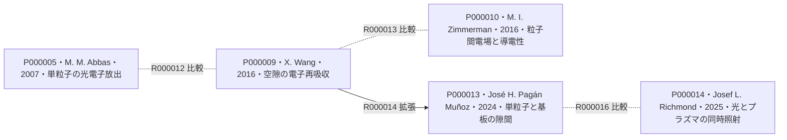
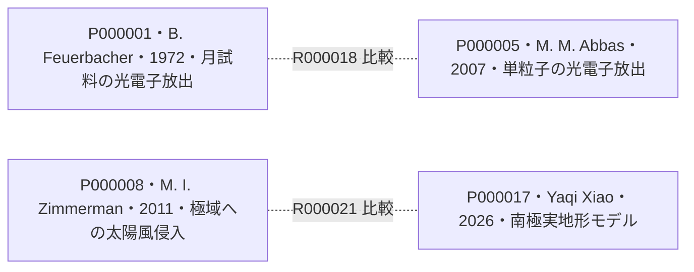

<!-- BEGIN GENERATED: topic-header -->
# 月面帯電：光電子シース・宇宙環境・地形・ダスト

[全体索引](<../../README.md>)
<!-- END GENERATED: topic-header -->

<!-- BEGIN GENERATED: topic-scope -->
月面の電位は何で決まり、日照・宇宙環境・地形・粒子の配置によってどう変わるか。
対象：月面の電流収支と光電子シース、月面電位の軌道観測と宇宙環境、クレーター・空洞の局所帯電、粒子の帯電機構と移動実験。
除外：帯電対策装置の設計、摩擦帯電の詳細、ダストの長距離輸送量の推定。
<!-- END GENERATED: topic-scope -->

<!-- BEGIN GENERATED: survey-status -->
調査日：2026-09-18 ｜ 対象期間：1972–2026年（今回採用した文献の範囲） ｜ 採用文献：17件  

この文献マップには誤りや抜けが含まれる可能性があります。気づいた点をご指摘いただければ、その都度修正します。
<!-- END GENERATED: survey-status -->

[関係図から見る](#論文間の関係図) ／ [比較の読み方](#比較の読み方)

## 先行研究比較表

要点は「問い／方法／判明点・適用範囲」の3項目です。OA・無料公開欄には利用できるリンクを記載します。API由来の情報にはその旨を添えます。

<!-- BEGIN GENERATED: paper-tables -->
### 光電子放出・電流収支・シース

| ID | タイトル | 著者 | 年 | 掲載誌／出版社 | OA・無料公開 | Preprint | 3項目要点 |
|---|---|---|---|---|---|---|---|
| P000001 | [Photoemission from lunar surface fines and the lunar photoelectron sheath](<https://ui.adsabs.harvard.edu/abs/1972LPSC....3.2655F/abstract>) | B. Feuerbacher et al. | 1972 | Proceedings of the Third Lunar Science Conference, vol. 3, 2655–2663 MIT Press | 未確認 | 未確認 | 問い：月試料の光電子放出は、月面上にどのような電子層を作るか。 方法：月試料の放出収率と電子エネルギー分布を測り、太陽光下の光電子シースを近似計算した。 判明点・適用範囲：月試料に基づく放出条件を与え、電子分布をMaxwell分布で近似する際の高エネルギー側のずれを示した。（[pp.2655,2662](<https://ui.adsabs.harvard.edu/abs/1972LPSC....3.2655F/abstract>)） 〔本文確認（出版版）〕 |
| P000002 | [Plasma and Potential at the Lunar Surface](<https://doi.org/10.1007/978-94-010-2647-5_22>) | Robert H. Manka | 1973 | Photon and Particle Interactions with Surfaces in Space, 347–361 D. Reidel Publishing Company | 未確認 | 未確認 | 問い：太陽風・磁気圏尾部や日照条件によって、月面電位はどう変わるか。 方法：電子・イオンの流入と光電子・二次電子の放出を電流収支で扱い、表面電位を推定した。 判明点・適用範囲：昼側の正帯電から夜側・高温プラズマ中の強い負帯電までを、入射電流と放出電流の釣り合いで整理した。（[p.347 要旨（所蔵は冒頭2頁）](<https://doi.org/10.1007/978-94-010-2647-5_22>)） 〔要旨確認（出版版）〕 |
| P000007 | [Simulations of the photoelectron sheath and dust levitation on the lunar surface](<https://doi.org/10.1029/2010ja015286>) | Andrew Poppe、Mihály Horányi | 2010 | Journal of Geophysical Research: Space Physics 115, A08106 American Geophysical Union | 未確認 | 未確認 | 問い：光電子の分布と時間依存の粒子帯電は、シース内の浮遊条件をどう変えるか。 方法：正午の平坦面を一次元PICで計算し、月試料由来の電子分布とMaxwell分布、粒子の帯電・軌道を比較した。 判明点・適用範囲：非単調な電位分布を示し、浮遊の平衡点が存在しても粒子がそこへ到達するとは限らないと整理した。表面からの剥離は扱わない。（[§2.1・考察（PDF pp.2,8）](<https://doi.org/10.1029/2010JA015286>)） 〔本文確認（出版版）〕 |
| P000011 | [Photoelectron Sheath and Plasma Charging on the Lunar Surface: Semianalytic Solutions and Fully-Kinetic Particle-in-Cell Simulations](<https://doi.org/10.1109/tps.2021.3110946>) | Jianxun Zhao et al. | 2021 | IEEE Transactions on Plasma Science 49(10), 3036–3050 IEEE | 未確認 | 未確認 | 問い：太陽風電子の流れを含む光電子シースを、半解析解で再現できるか。 方法：電子ドリフトを含む一次元の半解析解を導き、運動論的PIC計算と速度分布の違いを比較した。 判明点・適用範囲：同じ一次元条件で半解析解とPICの整合を示し、平均的な太陽風ではMaxwell分布とκ分布の結果が近いと報告した。（[要旨・§V（著者最終稿 pp.1–2,11–12）](<https://doi.org/10.1109/TPS.2021.3110946>)） 〔本文確認（著者最終稿）〕 |

### 軌道観測・宇宙環境・南極域モデル

| ID | タイトル | 著者 | 年 | 掲載誌／出版社 | OA・無料公開 | Preprint | 3項目要点 |
|---|---|---|---|---|---|---|---|
| P000003 | [Evidence for negative charging of the lunar surface in shadow](<https://doi.org/10.1029/2001gl014428>) | J. S. Halekas et al. | 2002 | Geophysical Research Letters 29(10), 1435 American Geophysical Union | 未確認 | 未確認 | 問い：日陰の月面はどの程度負に帯電し、その電位差を軌道上の電子観測から捉えられるか。 方法：Lunar Prospectorの電子分布から、電子の欠損領域（ロスコーン）のエネルギー依存性と上向き二次電子ビームを解析した。 判明点・適用範囲：夜側月面が探査機より平均約35 V低い電位にあると推定し、日陰での負帯電を観測で裏付けた。（[要旨・結論（PDF pp.1,3）](<https://doi.org/10.1029/2001GL014428>)） 〔本文確認（出版版）〕 |
| P000004 | [Large negative lunar surface potentials in sunlight and shadow](<https://doi.org/10.1029/2005gl022627>) | J. S. Halekas、R. P. Lin、D. L. Mitchell | 2005 | Geophysical Research Letters 32, L09102 American Geophysical Union | 未確認 | 未確認 | 問い：月が地球磁気圏尾部を通過するとき、日陰と日照域で大きな負帯電は起こるか。 方法：Lunar Prospectorの上向き電子ビームを探し、推定電位差の大きさが500 Vを超える事例と入射電子スペクトルを比較した。 判明点・適用範囲：500 V以上の負電位差を示す稀な事例が主にプラズマシートで生じ、日照域にも存在することを示した。（[要旨・結論（PDF pp.1,3–4）](<https://doi.org/10.1029/2005GL022627>)） 〔本文確認（出版版）〕 |
| P000006 | [Extreme lunar surface charging during solar energetic particle events](<https://doi.org/10.1029/2006gl028517>) | J. S. Halekas et al. | 2007 | Geophysical Research Letters 34, L02111 American Geophysical Union | 未確認 | 未確認 | 問い：太陽高エネルギー粒子（SEP）イベントは、月面の負帯電をどこまで強めるか。 方法：1998年4–5月の電子ビームから電位差を推定し、ACE・SOHOの粒子観測との比較とLunar Prospector全期間の事例検索を行った。 判明点・適用範囲：SEPイベント時に月面と探査機の電位差が約−4.5 kVに達し、大きな負帯電がSEPと磁気圏尾部の通過に集中することを示した。（[§2・§5–6（PDF pp.1–2,4）](<https://doi.org/10.1029/2006GL028517>)） 〔本文確認（出版版）〕 |
| P000017 | [Influence of Magnetospheric Plasma Environment on Surface Charging of the Lunar South Pole](<https://doi.org/10.48550/arxiv.2607.13510>) 〔プレプリント・未査読〕 | Yaqi Xiao、Xiaoman Wang、Ronghui Quan | 2026 | arXiv:2607.13510v1 &#91;physics.space-ph&#93;（プレプリント） arXiv | [プレプリントのみ確認](<https://arxiv.org/pdf/2607.13510v1>) | [あり（プレプリント）](<https://arxiv.org/pdf/2607.13510v1>) | 問い：南極の実地形と月の公転に伴うプラズマ環境の変化は、表面電位と電場をどう変えるか。 方法：LRO/LOLA標高データによる南緯86–90度の地形を用い、有限要素法とBPニューラルネットを組み合わせて半公転分を計算した。 判明点・適用範囲：地形による局所電場の増強を示し、プラズマシートでは表面電位が約−1000 V、計算領域の最大電場が約5 V/mになると予測した。（[要旨・§2.1・§4（v1 pp.1–3,14–16）](<https://arxiv.org/pdf/2607.13510v1>)） 〔プレプリント参照〕 |

### 極域クレーター・深い空洞

| ID | タイトル | 著者 | 年 | 掲載誌／出版社 | OA・無料公開 | Preprint | 3項目要点 |
|---|---|---|---|---|---|---|---|
| P000008 | [Solar wind access to lunar polar craters: Feedback between surface charging and plasma expansion](<https://doi.org/10.1029/2011gl048880>) | M. I. Zimmerman et al. | 2011 | Geophysical Research Letters, 38, L19202 American Geophysical Union (Wiley) | 未確認 | 未確認 | 問い：永久影の月極域クレーターへ太陽風が侵入する際、表面帯電とプラズマ膨張はどう影響し合うか。 方法：段差状の影領域を二次元の粒子運動論シミュレーションで表し、表面電荷の蓄積と二次電子放出を自己無撞着に計算する。 判明点・適用範囲：表面帯電と両極性膨張の負のフィードバックが準定常な後流を作り、その構造と底面への陽子流入を二次電子放出が調整すると示した。（[§2・§4（PDF pp.1–2,4–5）](<https://doi.org/10.1029/2011GL048880>)） 〔本文確認（出版版）〕 |
| P000012 | [Unconventional Surface Charging Within Deep Cavities on Airless Planetary Bodies: Particle-In-Cell Plasma Simulations](<https://doi.org/10.1029/2022je007589>) | Jin Nakazono、Yohei Miyake | 2023 | Journal of Geophysical Research: Planets, 128(2), e2022JE007589 American Geophysical Union (Wiley) | [出版版無料・ライセンス未確認](<https://da.lib.kobe-u.ac.jp/da/kernel/0100483394/0100483394.pdf>) | 未確認 | 問い：光電子放出がなくても、太陽風に開いた深い空洞の底は正に帯電するか。 方法：絶縁性の直方体空洞を三次元PICで計算し、深さと幅の比、入射条件、光電子放出による違いを調べる。 判明点・適用範囲：側壁で電子が失われて底部にイオン電流が優勢になる正帯電機構と、側壁由来の光電子がその正電位を緩和する働きを示した。（[要旨・§2・§4–5（本文pp.1–3,10–12）](<https://da.lib.kobe-u.ac.jp/da/kernel/0100483394/0100483394.pdf>)） 〔本文確認（出版版）〕 |
| P000015 | [Size-Dependent Surface Charging of Lunar Cavities Exposed to the Solar Wind](<https://doi.org/10.1029/2024ja033490>) | Jin Nakazono、Yohei Miyake | 2025 | Journal of Geophysical Research: Space Physics, 130(2), e2024JA033490 American Geophysical Union (Wiley) | 未確認 | 未確認 | 問い：空洞の大きさが表面シースの厚さをまたぐと、底部の正帯電はどう変わるか。 方法：PIC計算で空洞の入口幅5・30・100 mと深さ対幅比を変え、表面電荷と内部の空間電荷の寄与を比較する。 判明点・適用範囲：シースより小さな空洞では強い正帯電が生じ、大きな空洞では側壁付近のシースが電子の底部への供給を助けて正電位を緩和すると示した。（[要旨・§2・§5（PDF pp.1–3,14–16）](<https://doi.org/10.1029/2024JA033490>)） 〔本文確認（出版版）〕 |
| P000016 | [Electrostatic Charging of Lunar Cavities Governed by the Flow-to-Thermal Speed Ratio: 3D PIC Simulations and a Free-Fall Model](<https://doi.org/10.1029/2025ja034302>) | Jin Nakazono、Yohei Miyake、Wojciech J. Miloch | 2025 | Journal of Geophysical Research: Space Physics, 130(10), e2025JA034302 American Geophysical Union (Wiley) | [出版版無料・ライセンス未確認](<https://da.lib.kobe-u.ac.jp/da/kernel/0100497769/0100497769.pdf>) | 未確認 | 問い：太陽風の流速と電子・イオンの熱速度の関係は、深い空洞の底部電位をどう決めるか。 方法：Debye長より幅の小さな空洞を三次元PICで計算し、流速と縦横比への依存性を自由落下型の半解析モデルと比較する。 判明点・適用範囲：流速がイオンの熱速度より小さいと底部は負、イオンと電子の熱速度の間で正、電子の熱速度を超えるとほぼゼロになる三つの領域を示した。（[要旨・§2・§5–6（PDF pp.1–3,13–14）](<https://da.lib.kobe-u.ac.jp/da/kernel/0100497769/0100497769.pdf>)） 〔本文確認（出版版）〕 |

### 粒子の帯電・局所電場・移動実験

| ID | タイトル | 著者 | 年 | 掲載誌／出版社 | OA・無料公開 | Preprint | 3項目要点 |
|---|---|---|---|---|---|---|---|
| P000005 | [Lunar dust charging by photoelectric emissions](<https://doi.org/10.1016/j.pss.2006.12.007>) | M. M. Abbas et al. | 2007 | Planetary and Space Science 55, 953–965 Elsevier | 未確認 | 未確認 | 問い：月ダスト一粒の光電子放出効率は、粒径や粒子電位によってどう変わるか。 方法：Apollo 17・Luna 24の帰還試料とJSC-1模擬物の単粒子を電気力で保持し、120・140・160 nmの紫外線による帯電変化を測った。 判明点・適用範囲：単粒子の光電子放出効率と推定収率の粒径依存性を報告し、既報のバルク試料の値との差を示した。（[要旨・結論（pp.953–954,964）](<https://doi.org/10.1016/j.pss.2006.12.007>)） 〔本文確認（出版版）〕 |
| P000010 | [Grain-scale supercharging and breakdown on airless regoliths](<https://doi.org/10.1002/2016je005049>) | M. I. Zimmerman et al. | 2016 | Journal of Geophysical Research: Planets 121, 2150–2165 Wiley / American Geophysical Union | 未確認 | 未確認 | 問い：粒子間の局所電場はどこまで強くなり、何がその上限を決めるか。 方法：光電子放出と太陽風による差動帯電を、導電性を含む一次元モデルと固定粒子群の三次元計算で調べた。 判明点・適用範囲：粒子間の強い電場と小さな正味電荷が両立し、導電性が局所電場の上限を左右すると示した。粒子の離脱は計算していない。（[考察・§5（p.2163）](<https://doi.org/10.1002/2016JE005049>)） 〔本文確認（出版版）〕 |
| P000009 | [Dust charging and transport on airless planetary bodies](<https://doi.org/10.1002/2016gl069491>) | X. Wang et al. | 2016 | Geophysical Research Letters 43, 6103–6110 Wiley / American Geophysical Union | 未確認 | 未確認 | 問い：粉体面の粒子は、平均的なシース電場からの見積もりを超える電荷と離脱力をどう得るか。 方法：模擬粉体に紫外線・電子ビーム・プラズマを照射する比較実験と、粒子間空隙での電子再吸収モデルを組み合わせた。 判明点・適用範囲：微小空隙への放出電子の再吸収が局所的な負帯電と反発力を強めるpatched charge modelを提案し、実験で観測した粒子の跳躍を説明した。（[§2–4（pp.6104–6109）](<https://doi.org/10.1002/2016GL069491>)） 〔本文確認（出版版）〕 |
| P000013 | [Charging and Mobilization of Dust Particles on a Surface in Plasma](<https://doi.org/10.1103/physrevlett.133.115301>) | José H. Pagán Muñoz et al. | 2024 | Physical Review Letters 133, 115301 American Physical Society | 未確認 | 未確認 | 問い：固体基板に直接載る一粒でも、放出電子の再吸収によって帯電が増し、移動できるか。 方法：Kapton膜上のSiO₂粒子を電子ビームまたは紫外線で照射し、画像から求めた移動度を粒子と基板の帯電計算と比較した。 判明点・適用範囲：粉体間の空隙を扱うPCMを粒子と基板の隙間へ広げ、再捕集と移動の関係を示した。画像から求めた移動度は、表面からの離脱率とは異なる。（[PCM-SP・Figs.3–4（PDF pp.1–3）](<https://doi.org/10.1103/PhysRevLett.133.115301>)） 〔本文確認（出版版）〕 |
| P000014 | [Enhanced Charging and Mobilization of Photoemitting Dust Particles in a Low-Density Plasma](<https://doi.org/10.1029/2024gl113715>) | Josef L. Richmond et al. | 2025 | Geophysical Research Letters 52, e2024GL113715 Wiley / American Geophysical Union | 未確認 | 未確認 | 問い：光電子を放出する粉体に周囲のプラズマ電子が加わると、帯電と飛び出しはどう変わるか。 方法：模擬粉体への真空紫外線と低密度アルゴンプラズマの単独・同時照射を比べ、飛び出し数と電圧しきい値を測った。 判明点・適用範囲：同時照射で飛び出しと推定負電荷が増えることを示し、周囲の電子が光電子の移動を促すcharge pumpingで説明した。（[要旨・§3.2–3.3（PDF pp.1,5）](<https://doi.org/10.1029/2024GL113715>)） 〔本文確認（出版版）〕 |
<!-- END GENERATED: paper-tables -->

## 論文間の関係図

実線は文献中の言及、点線は本マップでの比較整理を表します。矢印は基礎・対象側から、それを拡張・利用・検証する側へ向きます。仮の関係には「仮」を添えます。

<!-- BEGIN GENERATED: relation-graphs -->
### 概観 · 1

### 光電子放出・電流収支・シース · 2

### 軌道観測・宇宙環境・南極域モデル · 3

### 極域クレーター・深い空洞 · 4

### 粒子の帯電・局所電場・移動実験 · 5

### 分類をまたぐ関係 · 6

図に未掲載の文献：該当なし。
<!-- END GENERATED: relation-graphs -->

## 関係の説明・参考情報

<!-- BEGIN GENERATED: relation-evidence -->
| 関係ID | 論文間の関係 | このように整理した理由 | 参考情報・参照版 | 区分 |
|---|---|---|---|---|
| R000001 | P000001 → P000007：手法利用 | 光電子のエネルギー分布：月試料から測った光電子分布をPICの放出条件に用い、Maxwell分布を仮定した場合との差を計算する。 | [P000007 / 出版版 / V1 / §2.1（PDF p.2） / 2026-09-18](<https://doi.org/10.1029/2010JA015286>) | 文献中の言及 AI確認・2026-09-18 |
| R000002 | P000002 — P000007：比較 | 表面電位から空間分布へ：電流収支による表面電位の整理と、電子を追跡するPICによるシース電位分布を比較できる。 限定：Mankaは所蔵された要旨・冒頭のみを参照。Poppeは正午の平坦面が対象。 | [P000002 / 出版版 / V1 / p.347 要旨（所蔵は冒頭2頁） / 2026-09-18](<https://doi.org/10.1007/978-94-010-2647-5_22>) [P000007 / 出版版 / V1 / §2.1・考察（PDF pp.2,8） / 2026-09-18](<https://doi.org/10.1029/2010JA015286>) | 本マップの比較整理 AI確認・2026-09-18 |
| R000003 | P000007 — P000011：比較 | シースモデルの仮定：Poppeは月試料由来の光電子分布と粒子浮遊を、Zhaoは太陽風電子のドリフトを含む半解析解とPICの整合を扱う。 | [P000007 / 出版版 / V1 / §2.1・考察（PDF pp.2,8） / 2026-09-18](<https://doi.org/10.1029/2010JA015286>) [P000011 / 著者最終稿 / V2 / 要旨・§V（著者最終稿 pp.1–2,11–12） / 2026-09-18](<https://doi.org/10.1109/TPS.2021.3110946>) | 本マップの比較整理 AI確認・2026-09-18 |
| R000004 | P000003 → P000004：拡張 | 日陰から日照域・高温プラズマへ：2002年の静穏な夜側での電位差推定を踏まえ、地球磁気圏尾部の日照域も含む強い負帯電へ対象を広げた。 | [P000004 / 出版版 / V1 / §1–2（PDF p.1、段落2,4） / 2026-09-18](<https://doi.org/10.1029/2005GL022627>) | 文献中の言及 AI確認・2026-09-18 |
| R000005 | P000003 → P000006：手法利用 | 上向き電子ビームによる電位差推定：2002年に検証した上向き二次電子ビームによる電位差推定を、SEP時の高い背景計数下でも使える診断として採用した。 | [P000006 / 出版版 / V1 / §2（PDF p.1、段落5–6） / 2026-09-18](<https://doi.org/10.1029/2006GL028517>) | 文献中の言及 AI確認・2026-09-18 |
| R000006 | P000006 — P000004：比較 | 強い負帯電を生む宇宙環境：2005年の磁気圏尾部・プラズマシートと、2007年の太陽高エネルギー粒子イベントを、強い負帯電が生じる別条件として比較できる。 | [P000006 / 出版版 / V1 / §2・§5–6（PDF pp.1–2,4） / 2026-09-18](<https://doi.org/10.1029/2006GL028517>) [P000004 / 出版版 / V1 / 要旨・結論（PDF pp.1,3–4） / 2026-09-18](<https://doi.org/10.1029/2005GL022627>) | 本マップの比較整理 AI確認・2026-09-18 |
| R000007 | P000017 — P000004：比較 | 磁気圏環境下の観測と予測：磁気圏プラズマ下の強い負帯電を共通の論点として、軌道観測による推定と南極の実地形を用いた予測を対比できる。 | [P000017 / プレプリント / V1 / 要旨・§2.1・§4（v1 pp.1–3,14–16） / 2026-09-18](<https://arxiv.org/pdf/2607.13510v1>) [P000004 / 出版版 / V1 / 要旨・結論（PDF pp.1,3–4） / 2026-09-18](<https://doi.org/10.1029/2005GL022627>) | 本マップの比較整理 AI確認・2026-09-18 |
| R000008 | P000008 — P000012：比較 | 地形とプラズマの侵入方向：両者とも地形による電子・イオンの到達差と表面帯電を扱うが、前者は影の段差へ横から膨張する太陽風、後者は深い空洞へ上から入射する流れを対象とする。 | [P000008 / 出版版 / V1 / §2・§4（PDF pp.1–2,4–5） / 2026-09-18](<https://doi.org/10.1029/2011GL048880>) [P000012 / 出版版 / V1 / 要旨・§2・§4–5（本文pp.1–3,10–12） / 2026-09-18](<https://da.lib.kobe-u.ac.jp/da/kernel/0100483394/0100483394.pdf>) | 本マップの比較整理 AI確認・2026-09-18 |
| R000009 | P000012 → P000015：拡張 | 空洞寸法とシース厚：2025年論文は2023年の局所的な正帯電を先行結果として明示し、空洞寸法とシース厚の関係へ検討を広げる。 | [P000015 / 出版版 / V1 / §1（PDF p.2） / 2026-09-18](<https://doi.org/10.1029/2024JA033490>) | 文献中の言及 AI確認・2026-09-18 |
| R000010 | P000012 → P000016：拡張 | 太陽風条件への拡張：2025年の流速論文は2023年のイオン駆動正帯電を明示して、代表流速の結果から流速と熱速度の比による三つの帯電領域へ検討を広げる。 | [P000016 / 出版版 / V1 / §1・§6（PDF pp.2,14） / 2026-09-18](<https://da.lib.kobe-u.ac.jp/da/kernel/0100497769/0100497769.pdf>) | 文献中の言及 AI確認・2026-09-18 |
| R000011 | P000015 → P000016：拡張 | 小さな空洞での速度比依存：流速論文は寸法による正帯電の緩和を先行結果として明示し、小さな空洞を対象に流速と熱速度の比による変化を調べる。 | [P000016 / 出版版 / V1 / §1（PDF pp.1–2） / 2026-09-18](<https://da.lib.kobe-u.ac.jp/da/kernel/0100497769/0100497769.pdf>) | 文献中の言及 AI確認・2026-09-18 |
| R000012 | P000005 — P000009：比較 | 単粒子の放出と粉体の再吸収：単粒子からの光電子放出と、粉体の空隙への電子再吸収を比較でき、放出特性と粒子配置による帯電を分けて読む手掛かりになる。 | [P000005 / 出版版 / V1 / 要旨・結論（pp.953–954,964） / 2026-09-18](<https://doi.org/10.1016/j.pss.2006.12.007>) [P000009 / 出版版 / V1 / §2–4（pp.6104–6109） / 2026-09-18](<https://doi.org/10.1002/2016GL069491>) | 本マップの比較整理 AI確認・2026-09-18 |
| R000013 | P000009 — P000010：比較 | 空隙での再吸収と導電損失：どちらも粒子スケールの帯電を扱うが、Wangは空隙の電子再吸収と跳躍、Zimmermanは差動帯電・導電損失・局所強電場に重点を置く。 | [P000009 / 出版版 / V1 / §2–4（pp.6104–6109） / 2026-09-18](<https://doi.org/10.1002/2016GL069491>) [P000010 / 出版版 / V1 / 考察・§5（p.2163） / 2026-09-18](<https://doi.org/10.1002/2016JE005049>) | 本マップの比較整理 AI確認・2026-09-18 |
| R000014 | P000009 → P000013：拡張 | 粒子間から粒子と基板の隙間へ：放出電子が微小空隙に再捕集されるPCMの考え方を保ち、粒子同士の空隙から単粒子と固体基板の隙間へ対象を広げる。 | [P000013 / 出版版 / V1 / PCM-SPの導入（PDF pp.1–2、文献16） / 2026-09-18](<https://doi.org/10.1103/PhysRevLett.133.115301>) | 文献中の言及 AI確認・2026-09-18 |
| R000015 | P000009 → P000014：拡張 | 光電子放出と周囲電子の流入：PCMの空隙内電位差と光電子再捕集を基礎に、周囲の電子流入が光電子放出と負帯電を増やす過程を加えて同時照射を調べる。 限定：charge pumpingの先行提案はYeo et al. (2022)。本マップでは途中の関連研究をすべて収録していない。 | [P000014 / 出版版 / V1 / §3.2 Plasma Charge Pumping（PDF p.5） / 2026-09-18](<https://doi.org/10.1029/2024GL113715>) | 文献中の言及 AI確認・2026-09-18 |
| R000016 | P000013 — P000014：比較 | 粒子配置と照射条件：電子再捕集を扱う実験同士として、単粒子と基板の隙間か粉体間の空隙か、電子ビーム中心かVUVと熱プラズマの同時照射かを比較できる。 | [P000013 / 出版版 / V1 / PCM-SP・Figs.3–4（PDF pp.1–3） / 2026-09-18](<https://doi.org/10.1103/PhysRevLett.133.115301>) [P000014 / 出版版 / V1 / 要旨・§3.2–3.3（PDF pp.1,5） / 2026-09-18](<https://doi.org/10.1029/2024GL113715>) | 本マップの比較整理 AI確認・2026-09-18 |
| R000017 | P000002 — P000003：比較 | 負帯電の理論と軌道観測：日陰での負帯電を電流収支から考える枠組みと、軌道上の電子分布から月面電位差を推定する観測をつなぐ。 限定：Halekasの約−35 Vは探査機基準。プラズマ基準の計算値とそのまま比較しない。 | [P000002 / 出版版 / V1 / p.347 要旨（所蔵は冒頭2頁） / 2026-09-18](<https://doi.org/10.1007/978-94-010-2647-5_22>) [P000003 / 出版版 / V1 / 要旨・結論（PDF pp.1,3） / 2026-09-18](<https://doi.org/10.1029/2001GL014428>) | 本マップの比較整理 AI確認・2026-09-18 |
| R000018 | P000001 — P000005：比較 | 試料の配置と光電子放出：月試料のバルク表面と空中保持した単粒子を比べ、粒径・配置が光電子放出の推定に与える違いを読む。 | [P000001 / 出版版 / V1 / pp.2655,2662 / 2026-09-18](<https://ui.adsabs.harvard.edu/abs/1972LPSC....3.2655F/abstract>) [P000005 / 出版版 / V1 / 要旨・結論（pp.953–954,964） / 2026-09-18](<https://doi.org/10.1016/j.pss.2006.12.007>) | 本マップの比較整理 AI確認・2026-09-18 |
| R000019 | P000007 — P000009：比較 | シース内の浮遊と表面からの離脱：シース内に既にある粒子の浮遊条件と、粉体の空隙で帯電を増やして粒子を離脱させる機構を比較する。 限定：浮遊の平衡点があることと、付着力を越えて表面から飛び出せることは別の問題。 | [P000007 / 出版版 / V1 / §2.1・考察（PDF pp.2,8） / 2026-09-18](<https://doi.org/10.1029/2010JA015286>) [P000009 / 出版版 / V1 / §2–4（pp.6104–6109） / 2026-09-18](<https://doi.org/10.1002/2016GL069491>) | 本マップの比較整理 AI確認・2026-09-18 |
| R000020 | P000011 — P000012：比較 | 平坦面から深い空洞へ：平坦面上の一次元シースと、側壁で電子が失われる三次元の深い空洞を対比し、形状が電流収支を変えることを読む。 | [P000011 / 著者最終稿 / V2 / 要旨・§V（著者最終稿 pp.1–2,11–12） / 2026-09-18](<https://doi.org/10.1109/TPS.2021.3110946>) [P000012 / 出版版 / V1 / 要旨・§2・§4–5（本文pp.1–3,10–12） / 2026-09-18](<https://da.lib.kobe-u.ac.jp/da/kernel/0100483394/0100483394.pdf>) | 本マップの比較整理 AI確認・2026-09-18 |
| R000021 | P000008 — P000017：比較 | 理想化した地形と南極の実地形：影の段差への太陽風侵入を追う運動論計算と、南極の標高データと変動するプラズマ環境を組み合わせるモデルを比較する。 限定：空間規模、入射条件、計算手法が異なり、同条件での相互検証ではない。 | [P000008 / 出版版 / V1 / §2・§4（PDF pp.1–2,4–5） / 2026-09-18](<https://doi.org/10.1029/2011GL048880>) [P000017 / プレプリント / V1 / 要旨・§2.1・§4（v1 pp.1–3,14–16） / 2026-09-18](<https://arxiv.org/pdf/2607.13510v1>) | 本マップの比較整理 AI確認・2026-09-18 |
<!-- END GENERATED: relation-evidence -->

<!-- BEGIN GENERATED: reading-notes -->
## 比較の読み方

- 読み始めるならManka 1973で電流収支、Halekas 2002・2005・2007で環境による違い、Poppe 2010とZhao 2021でシースモデルへ進む。PICは粒子を追跡してプラズマと電場を解く計算法、シースは表面近くで電荷が偏る層。
- 地形はZimmerman 2011からNakazono 2023・2025へ、粒子の移動はWang 2016からPagán Muñoz 2024・Richmond 2025へ読む。PCM（patched charge model）は、微小空隙への放出電子の再吸収による局所帯電を扱う。
- 月面電位の符号や大きさを比べるときは、日照・プラズマ条件・基準電位をそろえる。表面の平均電位と粒子間の局所電場、浮遊条件と付着した粒子の離脱は区別する。室内での粒子移動やXiao 2026の計算値は、月面での直接観測ではない。
<!-- END GENERATED: reading-notes -->

## 調査範囲と更新

<!-- BEGIN GENERATED: survey-notes -->
検索経路：Bukan経由のPaperpileライブラリ、Bukanの既存研究ノート、出版社・機関リポジトリ・Crossref。検索語：charging、lunar  
採否方針：月面の電流収支と光電子シース、月面電位の軌道観測と宇宙環境、クレーター・空洞の局所帯電、粒子の帯電機構と移動実験。  
除外範囲：帯電対策装置の設計、摩擦帯電の詳細、ダストの長距離輸送量の推定。  
調査範囲：Paperpile所蔵の文献を出発点に、4分類17本を選んだ初版。要旨・方法・結論の該当箇所と既存ノートを参照し、本文確認は関連箇所の確認を意味する。全頁の精読や網羅的なサーベイではない。  
未確認範囲：Manka 1973は所蔵ファイルの冒頭2頁のみ。Xiao 2026はarXiv v1のプレプリント；無料版やプレプリントの有無は一括調査していない。未確認は非公開を意味しない；参考文献の追跡と各枝の文献追加は今後の更新で行う  
今回の更新：初版として17本、4分類、21件の関係を追加。文献中の言及と本マップの比較整理を区別した。
<!-- END GENERATED: survey-notes -->

<!-- BEGIN GENERATED: navigation -->

<!-- END GENERATED: navigation -->

---

原著は各文献のDOI・公開記録をご参照ください。比較表と関係図は独自の整理であり、原著の全文、Abstract、図表は再配布しません。
